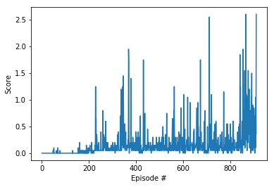

[//]: # (Image References)

[image1]: https://user-images.githubusercontent.com/10624937/42135623-e770e354-7d12-11e8-998d-29fc74429ca2.gif "Trained Agent"

## Environment Overview

This uses Unity's [Tennis](https://github.com/Unity-Technologies/ml-agents/blob/master/docs/Learning-Environment-Examples.md#tennis) environment.

![Trained Agent][image1]

#### Conditions

A double-jointed arm can move to target locations. A reward of +0.1 is provided for each step that the agent's hand is in the goal location. Thus, the goal of your agent is to maintain its position at the target location for as many time steps as possible.

#### Reward
- +0.1 if hit the ball over the net 
- -0.01 if let the ball hit the ground
- -0.01 if let the ball hit out of bounds
- The score is rewarded to both players

#### State Space

- Continuous 8 dimensions
- They correspond to:
    - positions (2)
    - velocities (2)
    - above for the ball and the racket (x2)
- Each player observes independently

#### Action Space
- Continuous 2 dimensions
    - racket's movement toward net and jumping 
    - Each player takes actions independently 
    - Each has range of [-1, 1]

####  Goal of the agent 

- get an average episode score of more than +0.5  
- the look back period to calculate the average is 100 consecutive eposodes 

## Used Algorithm 

- For the agents, used DDPG method
- Used simple NN for each of actor and critic network as following:
    - actor network
        - 3 fully connected layers with ReLu and Tanh activation functions 
        - The first two have size of 128 
        - last layer's output size = action size (4)
    - critic network
        - 3 fully connected layers with ReLu and Tanh activation functions
        - the first layer size = 128
        - second layer size = 128 + action size (4)
        - last layer's output size = 1

#### Performance

The agents learned the tennis and achieved +0.5 point score in average around in 900 episodes. 

-

#### Ideas for Future Work

- Architecture: Currently, just used simple NN. Going forward, using more complex architecture may improve the score
- Hyperparameter: the parameter has not been fully optimized. Here is another opportunity of improvement. (ex. Decay of noise can be introduced) 
- Replay Buffer: Since the play ground is symmetry, it may increase the training efficiency if the flipped results are added to the training samples

## Trained Model

- The trained model is `checkpoint_actor.pth`. You can use this on Unity environment mentioned below

#### Dependencies Settting

1. Download the Unity environment from one of the links below
    - Linux: [click here](https://s3-us-west-1.amazonaws.com/udacity-drlnd/P3/Tennis/Tennis_Linux.zip)
    - Mac OSX: [click here](https://s3-us-west-1.amazonaws.com/udacity-drlnd/P3/Tennis/Tennis.app.zip)
    - Windows (32-bit): [click here](https://s3-us-west-1.amazonaws.com/udacity-drlnd/P3/Tennis/Tennis_Windows_x86.zip)
    - Windows (64-bit): [click here](https://s3-us-west-1.amazonaws.com/udacity-drlnd/P3/Tennis/Tennis_Windows_x86_64.zip)
    

2. Place the file in this repository and unzip 
